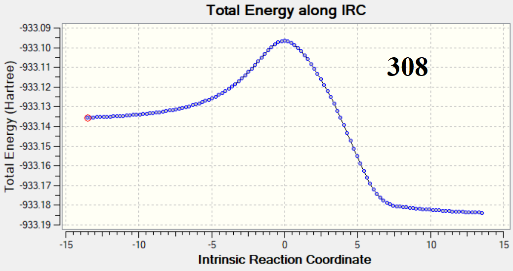
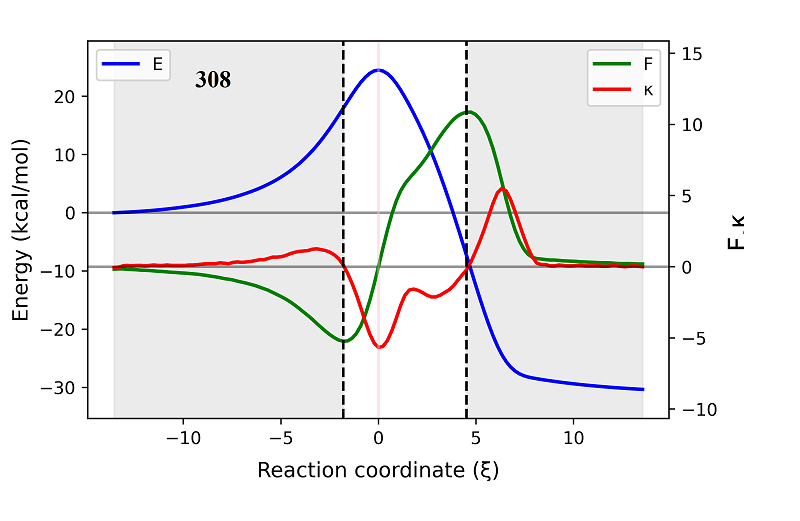
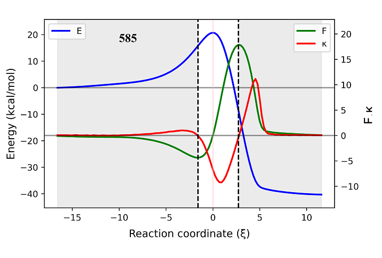

# AMADAR

## About

ADAMAR can identify the transition state of a Diels-Alder reaction, given the product, with a 95% success rate. All that is required is an input SMILES string of the product, and both reactant and product 3d structures will be generated; and the transition state will be generated and refined at a user-defined high level of theory. Further, ADAMAR can analyse the IRC for the specific DA process, for example in terms of Reaction Force Analysis (RFA).

## Getting Started

ADAMAR includes two main scripts, **__init.pynb** and **myIRCAnalyzer.ipynb**, dependent on **RDKit**, **os**,**sys**,**time** and **shutil**. There are several modules which are called by these two scripts. In addition **Gaussian** must be installed and accessible for calculation on the local machine. Support for **GAMESS** is not yet available.
There are two configuration files: **da.ini** and **analysis.ini**, in which all Diels-Alder transition state searches and analyses may be customized.

## Configuration Files

### da.ini

This file must be edited prior to generation of transition states. There are two sections to this configuration script **[job_details]** and **[flags]**. Please also see the sample da.ini provided.

**[job_details]**

NPROCSHARED = number of processors to be used for the jobs

D_SPLITTING = Final distance between the two fragments during the constrained optimization

CALC_LEVELS_RC = Levels of theory to be used in the optimization of reactants and cycloadducts. 
		Two levels must be given, separated by a semi-colon. 
		Users are advised to choose a semi-empirical and QM levels as the 1st and 2nd levels respectively.
		The defaults are PM6 and b3lyp/6-31G(d).

CALC_LEVELS_TS =Levels of theory to be used in the optimization of reactants and cycloadducts. 
		Three levels must be given, separated by a semi-colon. 
		The first level is used in the constrained optimization of the cycloadduct twoards the pseudo-guess TS
		The second level is for the refinement of the pseudo-guess into a guess TS. It is better using the same level of the 1st.
		The third level is needed for the final refinement of the guess-TS to the targeted QM accuracy.
		The defaults are PM6, PM6 and b3lyp/6-31G(d).

CALC_LEVEL_IRC = The level of theory to used in IRC calculations. This should be the same as the one used to refine the guess into the likely TS.

NBR_IRC_POINT_PP = Maximum number of points to use in the construction of the IRC path. 60 is good starting choice for mid-sized molecules, but may be increased or decreased depending on the system.

IRC_STEP_SIZE = Step-size to consider in the determination of the IRC path. 
		The default is 8, corresponding to 0.08 (amu) ^0.5 Bohr

NBR_PATHS=	This keyword can have two states : 1 in case we want to built a unique IRC file or 2 if we want to have 2 separate input files.
		The option 2 has not be activated yet, but will be very soon since the rest of analyses are still based on a unique IRC file containing both directions.

TS_ID_numbers = ID numbers of the reactions for which  for which the IRC path has to be generated. 
		These must be integers values separated by commas.
		This flag can also be set to 'ALL',which means all the TS predicted will be involved in IRC calculations.
        

**[flags]**

SCRATCH = 	This flag can only have 0 and 1 values. 
		1 tells the initialization code to regenerate the very initial input files saved in the R,C and TS folders
		0 tells the initialization code to skip the regeneration. This option will only work if there are already input files  in the R, C and TS or IRC folders.

RC_FLAG = 	This flag can only have 0 and 1 values.
		Value 1 tells the code to optimize reactants and cycloadducts, whereas 0 says the opposite.

TS_FLAG = 	This flag can only have 0 and 1 values.
		Value 1 tells the code to optimize the TSs, whereas 0 says the opposite.

IRC_FLAG = 	This flag can only have 0 and 1 values.
		Value 1 tells the code to run IRC calculations, whereas 0 says the opposite.
		This will work if and only if there are TS already predicted and saved in the ...TS/GTS/TS folder.

IRC_GEOMS_CONSTR = 	This flag can only have 0 and 1 values.
			Value 1 tells the code to generate geometries of the system from IRC paths.
			This will work only if there are IRC paths already constructed and saved in the IRC folder.
			Outputs are saved in the "paths" folder.

RFA_FLAG = 		This flag can only have 0 and 1 values.
			Value 1 is for authorizing the reaction force analysis to be done.
			Supplementary flags (keywords) should be given in the analysis.ini file to indicate which system to analyze.

RFD_FLAG = 		This flag can only have 0 and 1 values.
			Value 1 is for authorizing the atomic resolution of energy derivatives (along the IRC path) to be done.
			Supplementary flags (keywords) should be given in the analysis.ini file to indicate which system to analyze or which atoms (fragments) to invole in the decomposition.

WBOA_FLAG = 		This flag can only have 0 and 1 values.
			Value 1 enables the Wiberg Bond Order analysis to be carried out, while 0 is for the opposite.
			Supplementary flags (keywords) should be given in the analysis.ini file to indicate which system to analyze.
			It will work only if IRC natural population calculations have already been perfomed on the IRC geometries. These are saved in the "paths" folder.

OVERWRITE_FLAG = 	This flag tell whether the managder3 module to overwrite IRC folder as a new call is made, or not.
			The value 1 allows for overwriting, while 0 blocks it.
      
### analysis.ini

This file must be edited prior to analyzing IRC's that have already been generated. There are three sections to this configuration file, **[RFA]**, **[RFD]** and **[IRC_PATHS]**. Please also look at the example analysis.ini provided.

**[RFA]**

Unq_RFA = 	This keyword indicates the list of ID numbers of IRC files to include in the reaction force analysis.
		Values must be integers, separated by commas. 
		In case all the files are to be considered, the value "-1" must be used. 
		The value 0 means that no file is to be analyzed.

Multiple_RF = 	This keyword indicates the list of ID numbers of IRC files to include in the multiple RFA in order to superimpose their reaction force curves. 
		Values must be integers, separated by commas. 
		The value "-1" is not allowed as the number of overlayable systems must stay limited for efficiency.
		The value 0 disables the analysis.

Multiple_RE = 	This keyword indicates the list of ID numbers of IRC files to include in the multiple RFA in order to superimpose their potential energy curves. 
		Values must be integers, separated by commas. 
		The value "-1" is not allowed as the number of overlayable systems must stay limited for efficiency.
		The value 0 disables the analysis.

Multiple_RFC =  This keyword indicates the list of ID numbers of IRC files to include in the multiple RFA in order to superimpose their reaction force constant curves. 
		Values must be integers, separated by commas. 
		The value "-1" is not allowed as the number of overlayable systems must stay limited for efficiency.
		The value 0 disables the analysis.
		

**[RFD]**

JOB_ID = 	This keyword indicates the ID number of IRC file to consider for the the atomic decomposition of energy derivatives . 
		The value 0 disables the analysis.

ATOMS = 0	This keyword is for the list of atomic indexes to involve in the decomposition.
		Values must be integers, separated by commas.

FRAG =		This keyword is for the list of fragments to involve in the decomposition.
		Fragments are separated by semi-colons, while indexes of atoms from the same fragment are separated by commas.
		Make sure all the values are integers.
		The value 0 disables this analysis.

FRAG_NAMES = 	The names of the fragments must be given in the same order as indicated in the FRAG keyword.
		This section can be left blank or put any value when FRAG=0 because no fragment decomposition will be made.	

**[IRC_PATHS]**

IRC_ID= 	ID number of the IRC file for which the geometries have to be extracted and run (single point calculation,with pop analysis)

LEVEL = 	Level of theory to use for the previous job.

WBOA_ID= 	ID number of the system (IRC file) for which a Wiberg Bond order analysis should be done based on the output of the previous step.
		This will work if single point calculations for the geoemtries extracted from the IRC path of the system of interest was be run and saved in the "path" folder.
		

## Examples 

We provide here below a series of examples showing some basic manipulations that can be done with the code.

### Example 1 : Predicting the TS of a DA reaction knowing the cycloadduct (3-fluorocyclohexene).

**Settings**: 

- The following SMILES string was placed in the SMILES.txt file:
 
	 `FC1CC=CCC1`
 
- Note that we could have placed as many SMILES strings as possible.
- The "TS_FLAG" flag was set to 1 in the da.ini file, while keeping all the other flags of the "flags" section to 0. Only the "SCRATCH" flag had to be set to 1 because we needed the code to start the process from the very begining.
- The job details were set as follows:NPROCSHARED = 4 and D_SPLITTING = 0.24 and CALC_LEVELS_TS = pm6;pm6;b3lyp/6-31G(d). The rest of keywords in the "job_details' section could be left blank.

**Results**:

++ Pseudo-guess TS: 

Generated within 3 minutes. Note that this duration may change considerably depending on the size and complexity of the system.
The performance of the algorithm at this step can be enhanced in increasing the number of processors you allocate for the job.
This step returned 16 successive configurations of the system, of which the last one (highest energy one) constitutes the pseudo-guess TS.

++ Guess TS & TS: 

It took less than 30 seconds to refine the previous structure into the guess TS at the same semi-empirical PM6 level of theory.
The guess for the TS shows a slightly asymmetric TS, with the two nascent C-C bonds evaluated to 2.08 and 2.16 angstroms long.
The refinement of the guess at the b3lyp/6-31G(d) level resulted in a more asymmetric TS (with a unique imaginary frequency of 574.50i), in which the two C-C bonds measure 2.19 and 2.32 angstroms respectively.
	

### Example2 : Determining the IRC path from the predicted TS

**Settings**: 

- "The TS_ID_numbers" keyword ("job_details" section of the da.ini file) was given the values 308 and 585 separated by a comma. 
  This command tells the code to run IRC calculations from two predicted TSs (tsRx308p1 and tsRx585p1) of a list of 2000 TSs used to test the performance of the code. 
  Note that we could have chosen to consider more systems for this task.
- CALC_LEVEL_IRC = b3lyp/6-31G(d) ; NBR_IRC_POINT_PP = 60 ;IRC_STEP_SIZE = 8 . These details define the level of theory, the number of points to construct on the IRC path and the step-size. We could have been used other details, depending on the targeted accuracy and the nature of the system. These are the default settings. 
- NBR_PATHS=1 . This keyword ("job_details" section) must be set to 1 at the moment. In future version of the program, there will be the possibility to construct two separate input files for the IRC calculation, one for the forward direction and the other for the backward one.
- In the "flags" section of the da.ini file, the IRC_FLAG" keyword was set to 1, while keeping all the others to 0. Make sure you do not set the "OVERWRITE_FLAG" keyword to 1 because this may overwritte some of the files or folders you still need to look at.

**Results**:

Two input files for IRC calculations were produced, then executed. The energy profiles obtained are given here after.
These IRC paths were confirmed to link the reactant to the product configurations through the TS. 
R308p1 is predicted with an activation energy of 24.47 kcal/mol and reaction energy of -30.75 kcal/mol, while the same parameters are valued to 20.7 kcal/mol and -40.79 kcal/mol for R585p1 at the b3lyp/6-31G(d) level.

Rx308p1

R585p1

### Example3 : Reaction force analysis from a specific IRC path

**Settings**:

- The "RFA_FLAG" flag was set to 1 in the "flags" section of the da.ini file.
- Then, in the analysis.ini file, the following settings were considered : Unq_RFA = 308, 585; Multiple_RF = 0; Multiple_RE = 0 and Multiple_RFC = 0.
  These details tell the code to perfom a complete reaction force analysis for the systems with IDs 308 and 585. This imply that two plots should be returned (for the two systems), each containing three curves: the potential energy E of the system, the reaction force F and the reaction force constant K.
  Note that if we wanted for example to overlay the reaction force curves of the two systems on the same plot, we should have given the "Multiple_RF" keyword the values 308 and 585 separated by a comma.
  In addition, this analysis supposes that the IRC paths of Rx308p1 and Rx585p1 have already been generated and saved automatically in the appropriate folder. Otherwise, a message error of the kind ('FileNotFound') will be returned and the execution aborted.

**Results**:

The plots below show the results of the reaction force analysis. The profile of the reaction force constant K (red curves) seems to be a good indicator of the synchronicity of these reactions, while E is not very affected. 

Rx308p1

Rx585p1

### Example4 : Performing fragment decomposition of F and K

**Settings**:

- The "RFD_FLAG" flag was set to 1 in the "flags" section of the da.ini file.
- Then, in the analysis.ini file ('RFD" section), the following settings were considered : 
  JOB_ID = 585 
  ATOMS = 0
  FRAG = 18,19;20,21
  FRAG_NAMES = C18&C19,C20&21
  These details tell the code to perfom a fragment decomposition of F and K for the systems with ID 585. This imply that two plots should be returned, one for the showing the contributions of each fragment (group of atoms) to the reaction force F and the other to the reaction force constant K.
  Note that if we wanted for example to perfom this decomposition for specific atoms, we should have given a list of atomic indexes to the "ATOMS" keyword separated by commas. Like the RFA, this analysis supposes that the IRC paths of Rx308p1 and Rx585p1 have already been generated and saved automatically in the appropriate folder. Otherwise, a message error of the kind ('FileNotFound') will be returned and the execution aborted.

**Results**:

The plots below show the results of the decomposition of F and K in terms of contributions stemming from the pairs of terminal C atoms.  

F decomposition

K decomposition

